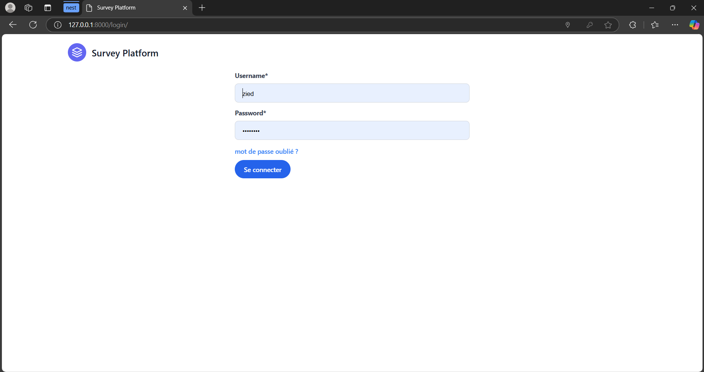
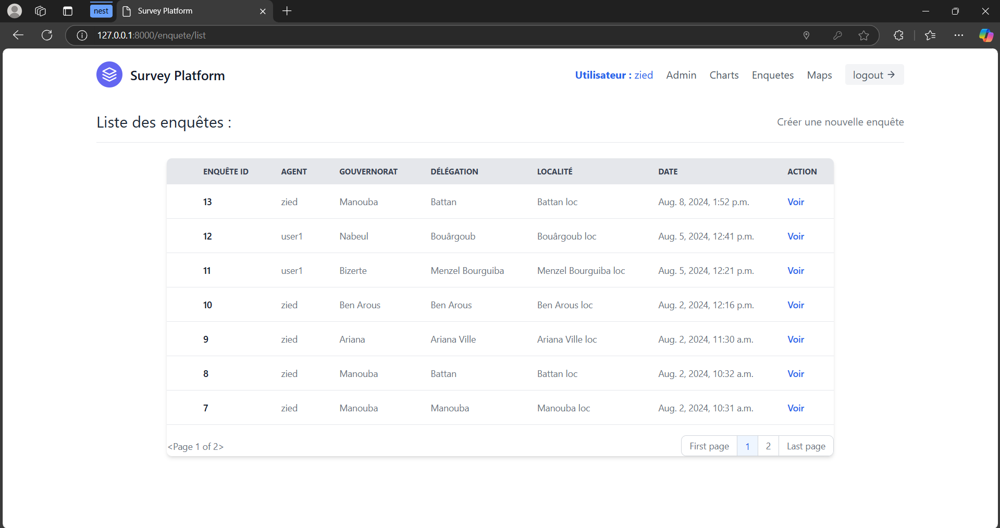
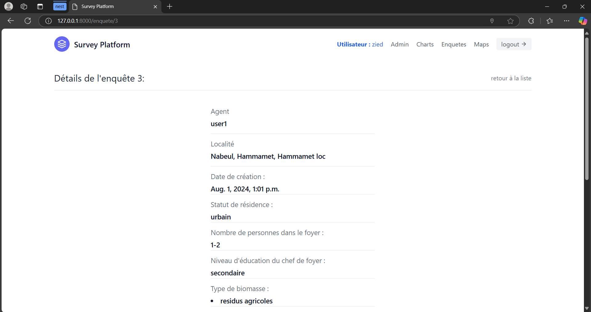
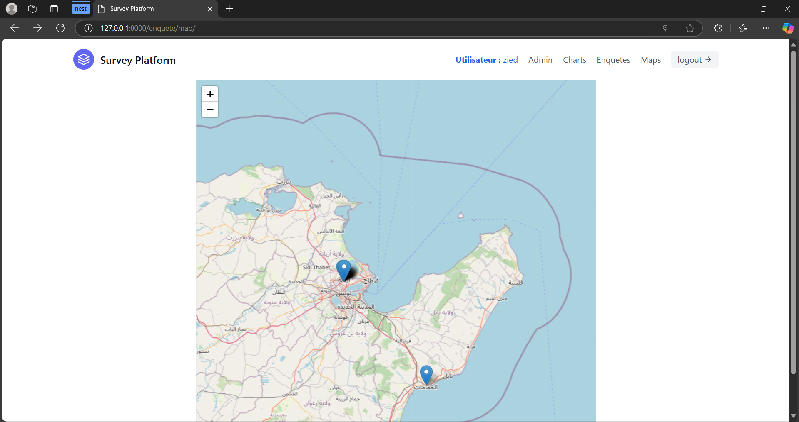
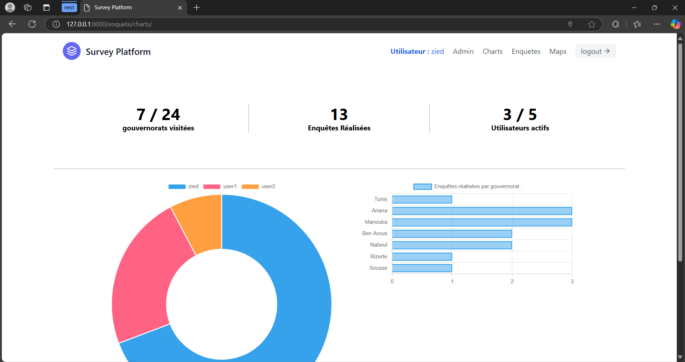
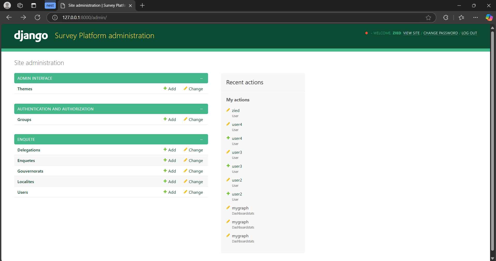

# Biomass Survey Management Platform

A full-stack web application for managing and tracking biomass consumption surveys in Tunisia. Developed using Django, Django templates, JavaScript and PostgreSQL during a professional internship at **Pictor Solutions**.

---

## 📝 Project Overview

This platform allows field investigators to conduct biomass consumption surveys, submit geolocated forms, and visualize results via interactive dashboards and maps.



---

## ⚙️ Technologies Used

- **Backend**: Django (Python)
- **Frontend**: Django templates and Javascript
- **Database**: PostgreSQL
- **Mapping**: Leaflet.js API
- **Charts & Visualization**: Chart.js
- **Authentication**: Multi-role secure login

---

## 🎯 Features

### 🧾 Investigator Portal

- Secure login system with role-based access
- Form submission with automatic geolocation
- View previous surveys and detailed results

  


---

### 🗺️ Interactive Mapping

- Map-based interface showing the location of completed surveys
- Built using Leaflet.js for smooth GIS integration



---

### 📊 Admin Dashboard

- Interactive charts for analyzing survey results
- Agent performance statistics
- Admin-only access to data editing and user management

  


---

## 🚀 Getting Started

### 1. Clone the Repository

```bash
git clone https://github.com/Zied-BenBahri/survey_platform.git
cd survey_platform
```
